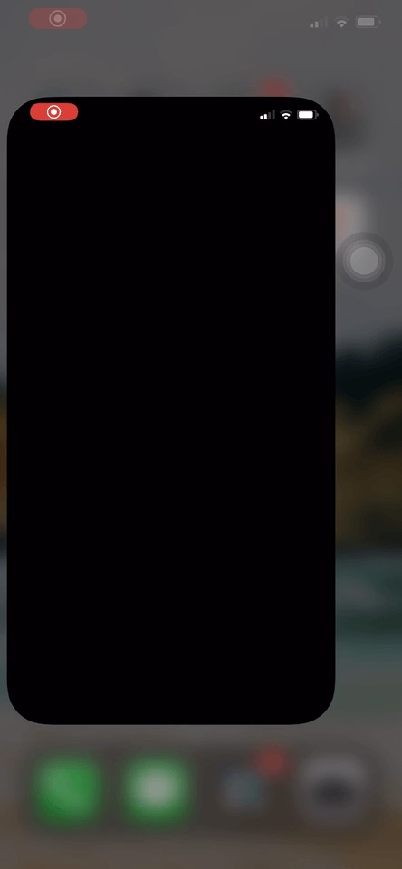

# iCar

### iCar is a smart iOS application, connects to cloud to retrive the real-time data that is posted using Raspberry Pi. 
#### Multiple sensors are used to get temperature, light conditions, collision alerts, current driver info, driving speed, speed-limits, location, lock/unlock status, find directions to car's location and more.

**Note** - Link to the app is not provided. Since, it’s an IoT project, to see all the features in action the Raspberry should be up and running with all the sensors connected to it. Please use the following examples as demo.

#### Features
  
-	Developed a feature to remotely lock/unlock the car using a smartphone without a physical key by connecting both the application and Raspberry Pi to Firebase cloud storage by posting and fetching over cloud.
-	Developed a feature to find the car’s current location from the GPS sensor connected to Raspberry Pi by developing a program in Python.
-	Developed features to get speed limits and alerts from car’s current location by making API calls to ‘Here API’ efficiently and alerting the user by playing sound and flashing screen when the current speed exceeds speed limit to keep the driver safe.
-	Implemented a feature to automatically alert users when driving closer to vehicles on the road using Ultrasonic sensor.
-	Expertise in JSON parsing and networks calls using various frameworks like RxSwift, Alamofire.

- **Home screen** 
  - Beautiful landing page
  - Displays car loaction status 
  - Lock/Unlock status
  - Car's moment status using animation
    - Animates when moving
    - Stays still when no moment is detected

- **Lock/Unlock car**
  - using **FaceId**
  - using registered **RF-tag**

 

- **Car details**
  - Alerts the user, when car moves too close to the vehicles infront of it
  - Get outside and inside temperature details
  - Get current speed and speed-limit in the current location
  - Watch the distance let to the front of the car, when too close the app notifies the user by playing sound.

- **Speed Alerts**
  - Displays car's current speed and speed-limit of the road
  - When car speed exceeds speed-limit, the app warns the user by flashing screen and plays sound
  - Up to date speed-limits are gathered from API service

- **Profile**
  - Get your driving score based on your driving style
    - sudden draking and acceleration decreases the score
    - Linear acceleration and braking increases the score 
  - By this fuel consumption and car's health can be improved
  - Compete with other drivers as a challenge
  

- **Help**
  - About the app section is provided to get started
  - This section describes all the features of the app 
  

